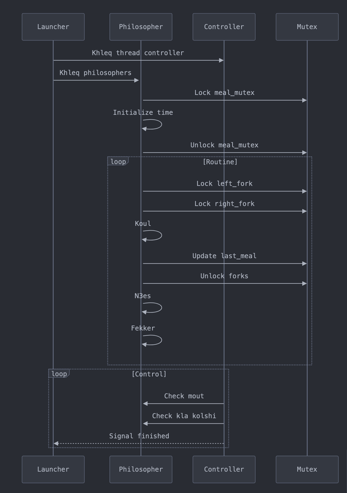

```
1. Kifash khadam l-program:
./philo 5 800 200 200 7
# 5: 3adad d-philosophers
# 800: lwqt bash ymout (b milliseconds)
# 200: lwqt bash yakol
# 200: lwqt bash yn3es
# 7: ch7al merra khasso yakol (optionnel)

```
<br>

```
2. N3tik Example kamel:

1. Initialization:
   - ghadi create 5 philosophers
   - Kol wa7ed 3ndo forchetta(fork) f limn w f lisr
   - Kolshi khasso yakol 7 marrat

2. Routine:
   Philosopher 1:
   - Kay7awel yaked forchetta 1 w 2
   - Kaykol 200ms
   - Kay khelli l-forchettes
   - Kayn3es 200ms
   - Kayfekker w y3awed

3. Controller (Watchdog):
   - Kay-checki kol philosopher wach mazal 7ay
   - Kay7seb ch7al klaw
   - Ida chi wa7ed mat wla kolchi kla, kay-7ebes program
```

<br>

```
3. Tips Muhimmin (Important Tips):

1. Testing:
   - Jerreb b3adad kbir d philosophers (99)
   - Jerreb b timing sghir (60 60 60)
   - Chof wach kayn chi deadlock

2. Debugging:
   - Zid prints m7umyin b mutex bash tfhem l-flow
   - Checki l-timing b get_current_time()
   - T2kked bli kolchi protected b mutex mn data races
```

<br>

```
4. Common Problems w Solutions:

1. Deadlock:
   - Dir delay l philosophers zwjyin
   - T2kked bli kol philosopher kay7el l-mutex f order mzyan

2. Data Race:
   - Protection b mutex l kol shared variables
   - Minimizi lwqt li kay-b9a fih l-mutex locked

3. Performance:
   - Ma tdirch bzaf d usleep
   - 7awel tminimizi l-mutex locks
```
<br>

<div align="center">
    
</div>
